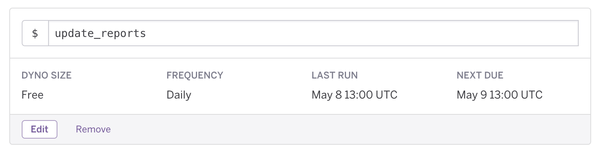

# data.world & Amazon MWS Connector

## Getting Started

1. [Create a dataset](https://data.world/create-a-dataset) on data.world
2. You will need your own [Heroku](https://www.heroku.com) account
3. Deploy to Heroku by pressing the fancy-looking button above
    * This integration allows you to save all of the reports into one dataset or to multiple datasets. For the latter,
  take a look at the [Storing Reports in Multiple Datasets](#storing-reports-in-multiple-datasets) section.
    * `App name` is optional as one will be automatically assigned, but we recommend something descriptive
    * Take a look at the [Config Vars](#config-vars) section for more details on the individual configuration variables
    * The initial deployment will take a couple of minutes as it's pulling your historical data
4. Once deployment is done, click on 'Manage App' to go to the app's 'Overview' page
5. Under 'Installed add-ons', click on 'Heroku Scheduler'
6. Add a new job. The command to use is `update_reports`.
    * Note that times are in UTC. Use a timezone converter if you would like your job to run at a specific local time.

As an example, the following job is scheduled to run daily at 8 AM CDT:

### Storing Reports in Multiple Datasets

As mentioned in [Config Vars](#config-vars), you can skip certain reports by leaving the associated filename field
blank. If you wanted each report in a separate dataset, you can do so by performing multiple deployments, and
only including the name of one filename on each deployment.

This is a good option when you have a ton of data and you're concerned about blowing past a dataset's size limits.

### Config Vars

 * The various `_FILENAME` variables determine both the name of the files, as well as which reports to place on that
 dataset. To skip a report, simply leave the name blank.
 * `START_DATE:` How far back to pull your historical data. Format: `2017-01-01`
 * `DW_TOKEN:` Pay a visit to https://data.world/settings/advanced and copy the Read/Write token
 * `DW_DATASET_SLUG:` As an example, if the URL of your dataset were `https://data.world/my-org/my-cool-dataset`,
 the dataset slug would be `my-org/my-cool-dataset`
 * `MARKETPLACE_IDS:` Marketplace IDs for the marketplaces you are registered to sell in. For the US market, use
 `ATVPDKIKX0DER`. Values for other markets can be found
 [here](http://docs.developer.amazonservices.com/en_US/dev_guide/DG_Endpoints.html). Multiple markets can be checked
 by including them as a comma-separated list, such as `ATVPDKIKX0DER,A2EUQ1WTGCTBG2`
 * The remaining variables are your Amazon MWS credentials that you receive upon registering as a developer.
 Instructions for doing so are available [here](http://docs.developer.amazonservices.com/en_US/dev_guide/DG_Registering.html).

### Known Issues

This integration currently only supports two report types: All Orders and FBA Returns. Additional reports can be
requested through [data.world support](#support), or added by forking this repository and submitting a pull request.

### Support

For support, either create a [new issue](https://github.com/datadotworld/heroku-dw-mws-connector/issues) here on
GitHub, or send an email to help@data.world.
